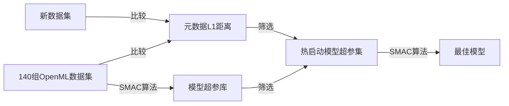

## AutoML定义

**定义1（AutoML问题）**：对于$i=1, 2, 3, \cdots, n + m$，记特征向量为$x_i \in \mathbb{R} ^ d$及其对应目标值为$y^i \in Y$，给定训练集$D_{train} = \{(x_1, y_1), \cdots, (x_n, y_n)\}$以及来自同一数据分布下的测试集$D_{test} = \{(x_{n+1}, y_{n+1}), \cdots, (x_{n+m}, y_{n+m})\}$，同时设定问题使用的资源预算（一般是指计算资源，如CPU、内存等）为$b$、损失函数为$\mathbb{L}(.,.)$，AutoML问题即为计算测试集预测值$\widehat{y}_{n+1}, \cdots, \widehat{y}_{n+m}$，该结果的损失则定义为$\frac{1}{m}\sum_{j=1}^{m}\mathbb{L}(\widehat{y}_j, y_j)$。

AutoML问题一般被形式化为一种算法选择与超参数优化相结合的问题（Combined Algorithm Selection and Hyperparameter optimization，**CASH**，AUTO-WEKA）。AutoML最重要的两个问题是：（1）没有一种机器学习算法能够在所有数据集上都表现良好；（2）一些机器学习算法（如非线性支持向量机，non-linear SVM）极度依赖超参优化。后一个问题可以通过**贝叶斯优化（Bayesian Optimization）**解决，该方法已经成为AutoML系统的核心组成。而由于算法效果在一定程度上取决于其超参数是否得到了适当的调优，所以前一个问题和后一个问题实际上是交织在一起的。但是，实际上这两个问题可以有效地作为一个单独的、结构化的、联合的优化问题来解决。

**定义2（CASH问题）**：记$\mathbb{A} = \{A^{(1)}, \cdots, A^{(R)}\}$为算法集、算法$A^{(j)}$的超参集为$\Lambda^{(j)}$、$D_{train} = \{(x_1, y_1), \cdots, (x_n, y_n)\}$为训练集，训练集$D_{train}$被分为$K$组交叉验证集$\{D_{train}^{(1)}, \cdots, D_{train}^{(K)}\}$与$\{D_{valid}^{(1)}, \cdots, D_{valid}^{(K)}\}$，即对于$i=1, 2, 3, \cdots, K$，$D_{train}^{(i)} = D_{train} / D_{valid}^{(i)}$，记$\mathbb{L}(A_{\lambda}^{(j)}, D_{train}^{(i)}, D_{valid}^{(i)})$为超参为$\lambda$的算法$A^{(j)}$经由训练集$D_{train}^{(i)}$训练后在验证集$D_{valid}^{(i)}$上的损失，那么CASH问题可定义为最小化上述损失，即
$$
A^*, \lambda_* = argmin_{A_{(j)} \in \mathbb{A}, \lambda \in \Lambda^{(j)}} \frac{1}{K}\sum_{i=1}^{K}\mathbb{L}(A_{\lambda}^{(j)}, D_{train}^{(i)}, D_{valid}^{(i)})
$$

CASH问题首先由Thornton等在AUTO-WEKA系统中提出，该系统基于机器学习框架WEKA与一种基于树结构的贝叶斯优化方法。简而言之，贝叶斯优化适合于生成超参数设置与测量性能之间关系的概率模型；该模型被用于选择最优超参设置、使用该模型评价超参设置、根据该评价结果更新模型并进行迭代。基于高斯过程的贝叶斯优化方法在数值型超参的低维问题上表现最好，而基于树结构的贝叶斯优化方法则在部分离散的高维结构化问题上表现地更为成功。在基于树结构的贝叶斯优化方法的方法中，Thornton等发现了一种**基于随机森林的SMAC算法**，AUTO-SKLEARN正是基于该算法解决AutoML中的CASH问题。该算法基于随机森林模型，其最显著的特征是能够通过一次评估尽早丢弃性能不佳的超参数设置来实现快速交叉验证。

## Auto-Sklearn原理

AUTO-SKLEARN的贝叶斯超参优化方法中包含两个新组件：基于**元学习**的贝叶斯优化初始化方法和基于优化过程超参配置的**组合模型**自动构建方法。前者通过元学习方法，热启动贝叶斯优化过程，结果表明对系统效率有明显提升；后者的引入使得系统能够使用在贝叶斯优化过程中得到的所有模型。两者协同作用，可以有效提高模型的选择速度以及最终模型预测效果，AUTO-SKLEARN整体原理如下图所示：

### AUTO-SKLEARN优化方法

#### 基于元学习的贝叶斯优化初始化方法

领域专家通常能够从以往的任务中获取知识，即学习机器学习方法在以往任务中的表现。在元学习领域中，则可以通过对跨数据集的学习算法性能的推理来模仿这种策略。而在AUTO-SKLEARN中，选择通过元学习方法筛选出新数据集中可能获得最好效果的机器学习方法。除了不同模型在大量数据集上的表现效果数据（即**评价指标**）外，AUTO-SKLEARN还将能够高效计算出的**数据集元数据**作为元学习的输入，用以决策新数据集适用于哪种机器学习方法。

元学习方法与贝叶斯优化方法互补性很强：元学习方法能够快速推荐适合的机器学习方法，并能够得到较好的运行效果，但是并无法提供模型性能的细粒度信息；而对于机器学习框架下的整体超参集使用贝叶斯优化方法，则运行会较为缓慢，但随着时间增加能够对模型性能进行微调。因此，AUTO-SKLEARN基于元学习方法选择$k$种机器学习方法，并基于此启动贝叶斯优化过程。

AUTO-SKLEARN的元学习优化过程分为离线阶段和在线阶段两部分：离线阶段，对于数据仓库（[OpenML](https://www.openml.org/)中的140个数据集）中的每个数据集，计算其元数据特征集，同时使用贝叶斯优化方法计算得到并存储每种机器学习方法对应的效果最好的模型超参配置（以2/3训练集、1/3测试集、交叉验证10次，运行SMAC算法24小时）；在线阶段，根据新数据集$\mathbb{D}$，计算得到该数据集的元数据特征集，并计算与数据仓库中的数据集元数据特征间的**L1距离**，选取距离最接近的**$k=25$**个数据集的最佳模型超参配置用以启动贝叶斯优化方法。

AUTO-SKLEARN提取了**38个元数据**特征用来描述数据集，包括简单的信息论和统计特征，例如数据量、数据特征数量、数据特征类数量、数据特征偏度、目标熵等，具体如下图所示：

#### 基于优化过程超参配置的组合模型自动构建方法

贝叶斯超参优化是一种能够通过数据高效查找到最优超参的方法，但是在只需要获得较好预测效果的情况下，这是一种十分消耗计算资源的过程：计算过程中得到的机器学习模型都是不存储的，甚至包括一些预测表现良好的模型。因此，AUTO-SKLEARN提出了一种模型组合的方法，该组合模型避免了提交单个模型的超参设置，因此比标准超参优化方法更健壮（不容易产生过拟合）。

一般来说，组合模型会优于单一模型。如果组合模型基于的单一模型足够强大且相互关联性不强，则组合模型在任务中的表现会更好。当单一模型在原理上是不同时，组合模型更有可能是灵活机器学习框架下的强模型耦合。

然而，简单地将贝叶斯优化得到的模型使用平均加权的方法组合起来并不能很好的满足任务需求。相反，保留所有单一模型的预测结果，使用留出法（hand-out）调整各模型权重是极为重要的。AUTO-SKLEARN尝试了多种方法来优化组合模型权重：堆叠法、无梯度数值优化方法以及集合选择方法。堆叠法和无梯度数值优化方法计算成本高且容易过拟合，集合选择方法则快速且不容易过拟合。简而言之，**集合选择方法（Caruana等人提出）是一种典型的贪心法，从空集合开始，迭代添加能够最大化组合模型验证表现的模型（平均权重但允许重复）**。

## AUTO-SKLEARN系统架构

AUTO-SKLEARN基于SKLEARN机器学习框架，包括**15种分类算法、14种预处理算法以及4种数据预处理算法**，上述算法参数化为110种超参，基于SMAC方法对上述超参进行最优化，系统结构如下图所示：

